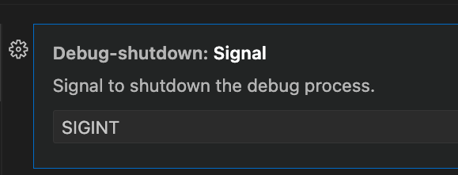

# debug-shutdown
(Only works with Unix systems)

## Features

A custom shutdown button for debug in vscode.

When the `Shutdown` button is pressed, the command `pkill -<signal> __debug_bin` will be sent to a child process. It allows, for example, our golang code to identify this signal and run the graceful shutdown.

The default signal used is `SIGINT`, but it can be changed to any other option by the user:

